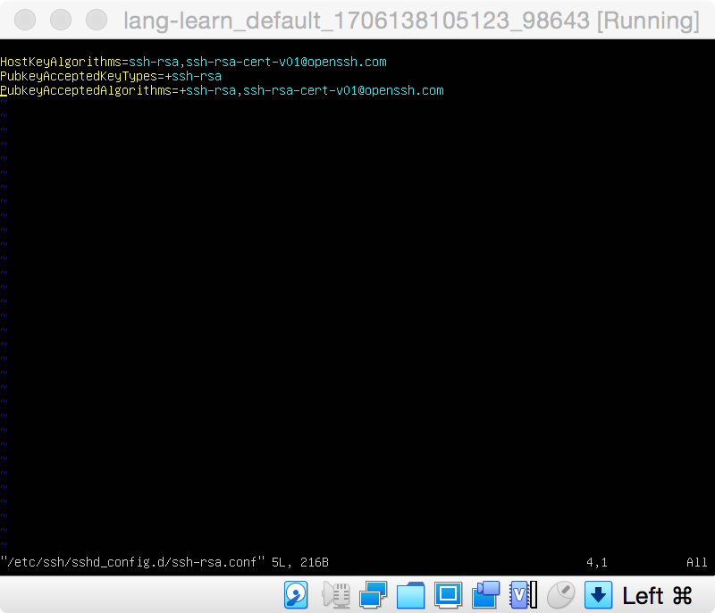

**Vagrant + Ubuntu 22.04(Jammy)**

Run `vagrant up` failure

> Warning: Authentication failure
> ...
> Warning: Authentication failure

    <https://unix.stackexchange.com/questions/674582/how-to-enable-ssh-rsa-in-sshd-of-openssh-8-8>

> vagrant@ubuntu-jammy:~$ sudo vi /etc/ssh/sshd_config.d/ssh-rsa.conf
> HostKeyAlgorithms=ssh-rsa,ssh-rsa-cert-v01@openssh.com
> PubkeyAcceptedKeyTypes=+ssh-rsa
> PubkeyAcceptedAlgorithms=+ssh-rsa,ssh-rsa-cert-v01@openssh.com

Change display mode to _VMSVGA_

